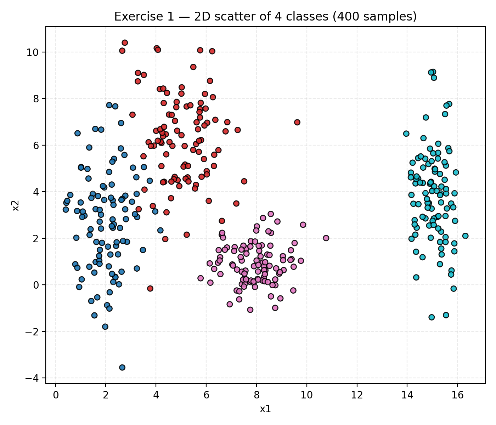
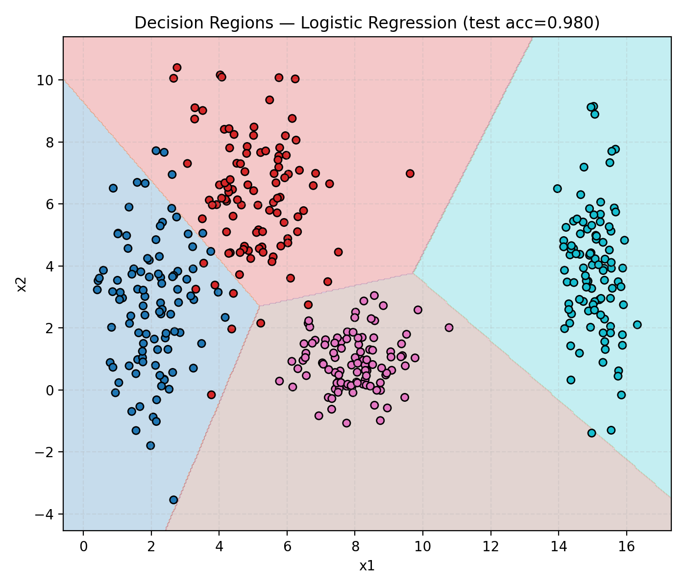
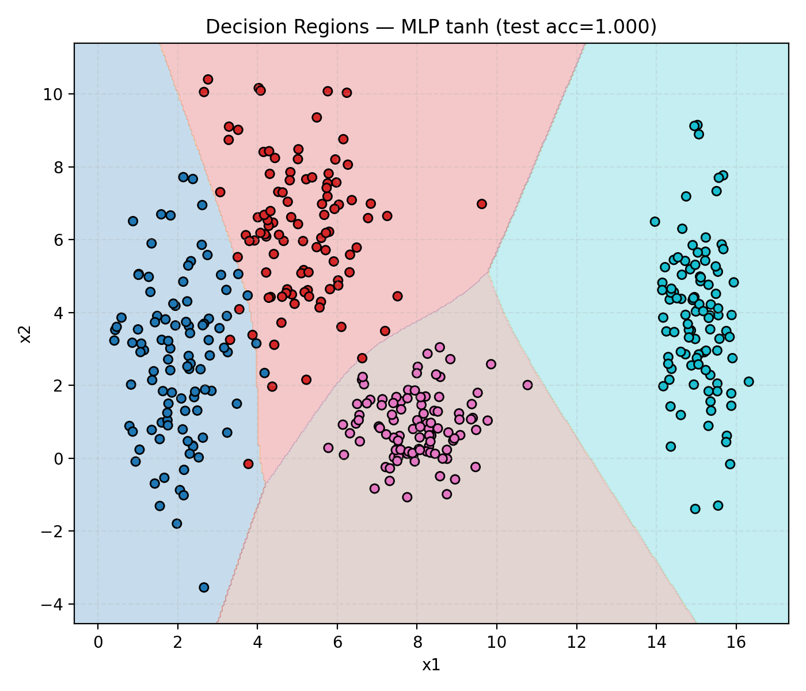
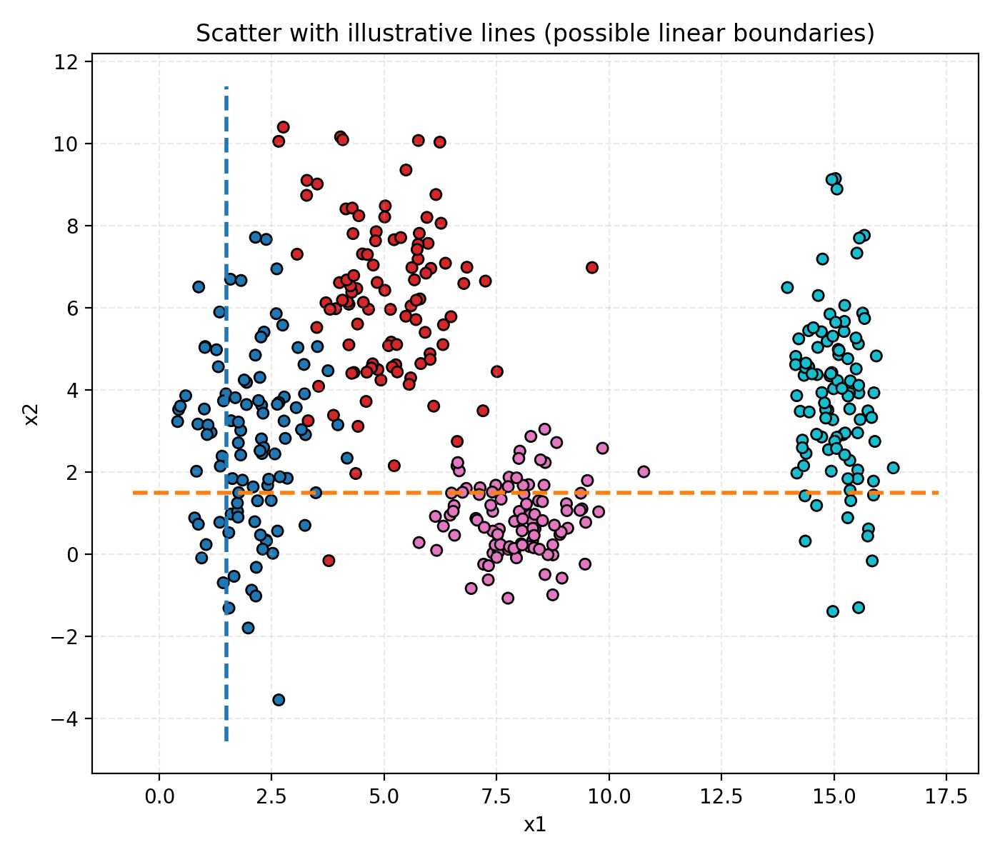

# Exercise 1 — Exploring Class Separability in 2D

## 1. Dataset Generation
A synthetic dataset was created with a total of **400 samples**, equally divided among **4 classes (100 each)**.  
Each class was drawn from a **2D Gaussian distribution** with the following parameters:

| Class | Mean (μ) | Standard Deviation (σ) |
|:------|:----------|:-----------------------|
| 0 | [2, 3] | [0.8, 2.5] |
| 1 | [5, 6] | [1.2, 1.9] |
| 2 | [8, 1] | [0.9, 0.9] |
| 3 | [15, 4] | [0.5, 2.0] |

The resulting data points form four distinct clusters in the 2D plane.

---

## 2. Scatter Plot and Observations

Below is the scatter plot showing the 400 samples colored by class:

**Observations:**
- **Class 0** is centered around (2, 3) and vertically elongated because of the large σ_y = 2.5.  
- **Class 1** (mean ≈ (5, 6)) forms a more compact cluster slightly above Class 0.  
- **Class 2** (mean ≈ (8, 1)) lies in the lower-right area and is fairly circular.  
- **Class 3** (mean ≈ (15, 4)) is far to the right, clearly separated from the others.

There is **little overlap** between most classes — only minor intersections between Classes 0 and 1 due to their proximity.

---

## 3. Linear vs Non-linear Decision Boundaries

Two models were trained to visualize the decision regions:

- **Logistic Regression (linear classifier)**
- **MLP with tanh activation (non-linear classifier)**

### Linear Model (Logistic Regression)

The linear model creates **straight decision boundaries**, effectively separating most clusters.  
Its test accuracy reached **0.98**, showing that the dataset is *almost linearly separable*.

---

### Non-linear Model (MLP with tanh)

The MLP achieved **perfect accuracy (1.00)** and learned **slightly curved boundaries**, allowing a smoother fit between classes with small overlap.

---

## 4. Manual Boundary Sketch

Below is a scatter plot with manually drawn illustrative linear boundaries that could roughly separate the four classes:

The dashed lines represent possible linear decision boundaries that a simple classifier could learn.  
A neural network could create smoother, curved separations in the overlapping regions.

---

## 5. Analysis

1. **Distribution and overlap:**  
   Each class forms a distinct Gaussian cluster. The spread differs per class, producing varying degrees of overlap. The largest overlap occurs between Classes 0 and 1 because they are spatially closer and both elongated along the y-axis.

2. **Can a linear boundary separate all classes?**  
   Almost. The data is *mostly* linearly separable — a combination of a few straight lines can correctly classify most points. However, perfect separation may require non-linear adjustment near overlapping regions.

3. **Expected neural network boundaries:**  
   A neural network with non-linear activation (like tanh) would learn slightly curved or piecewise-linear boundaries. These adapt to subtle overlaps, refining the classification margins beyond what purely linear models can achieve.

---

## 6. Conclusion

This exercise demonstrates that even when data is mostly separable with straight lines, neural networks with non-linear activation can learn smoother and more flexible decision surfaces, improving performance where overlap or curvature exists.

---
