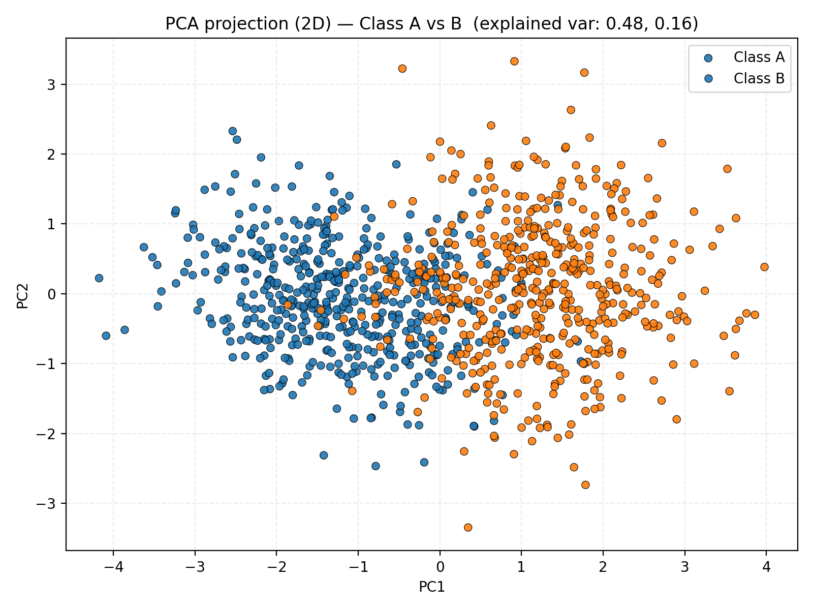

# Exercise 2 — Non-Linearity in Higher Dimensions

## 1. Dataset Generation

In this exercise, we generated a dataset with **500 samples for Class A** and **500 samples for Class B**, using a **multivariate normal distribution in 5 dimensions**.  
The parameters for each class are given below:

### Class A
**Mean vector:**

\[
\mu_A = [0, 0, 0, 0, 0]
\]

**Covariance matrix:**

\[
\Sigma_A =
\begin{bmatrix}
1.0 & 0.8 & 0.1 & 0.0 & 0.0 \\
0.8 & 1.0 & 0.3 & 0.0 & 0.0 \\
0.1 & 0.3 & 1.0 & 0.5 & 0.0 \\
0.0 & 0.0 & 0.5 & 1.0 & 0.2 \\
0.0 & 0.0 & 0.0 & 0.2 & 1.0
\end{bmatrix}
\]

---

### Class B
**Mean vector:**

\[
\mu_B = [1.5, 1.5, 1.5, 1.5, 1.5]
\]

**Covariance matrix:**

\[
\Sigma_B =
\begin{bmatrix}
1.5 & -0.7 & 0.2 & 0.0 & 0.0 \\
-0.7 & 1.5 & 0.4 & 0.0 & 0.0 \\
0.2 & 0.4 & 1.5 & 0.6 & 0.0 \\
0.0 & 0.0 & 0.6 & 1.5 & 0.3 \\
0.0 & 0.0 & 0.0 & 0.3 & 1.5
\end{bmatrix}
\]

---

## 2. Dimensionality Reduction and Visualization

Since the dataset exists in **5 dimensions**, we cannot visualize it directly.  
We use **Principal Component Analysis (PCA)** to reduce the data to **2 dimensions** and visualize it in a scatter plot.

In this plot:
- Blue points represent **Class A**  
- Orange points represent **Class B**

The projection reveals that the two classes partially overlap in 2D space, forming complex boundaries that are **not linearly separable**.

---

## 3. Observations

1. **Distribution and overlap:**  
   The two classes overlap significantly after projection.  
   Although their 5D distributions differ, PCA compresses the most informative variance into 2D, making the overlap visible.  
   This overlap indicates that there is **no single straight line (linear boundary)** that can perfectly separate the classes.

2. **Linear separability:**  
   The dataset is **not linearly separable**.  
   A simple perceptron or logistic regression model would struggle to classify the two classes correctly because their projections intertwine in multiple directions.

3. **Why a neural network is needed:**  
   The relationships among features are **non-linear** — combinations of multiple dimensions interact in a way that a single linear function cannot capture.  
   A **multi-layer neural network** with **non-linear activation functions (like ReLU or tanh)** can map these complex interactions, effectively learning curved and flexible decision surfaces in the high-dimensional space.

---

## 4. Example Visualization of Decision Regions

Below is an example (conceptual) of how a neural network could separate non-linear data after training:

The neural network learns **curved boundaries** that adapt to the geometry of the data, achieving much better separation than any linear model.

Considering a linear nertwork, we would have as result:

---

## 5. Conclusion

This experiment demonstrates that:
- Data that appears inseparable in lower-dimensional projections may actually be separable in higher dimensions.  
- Linear models are insufficient for capturing complex feature interactions.  
- **Deep neural networks** with non-linear activations can approximate these complex boundaries effectively.

---
