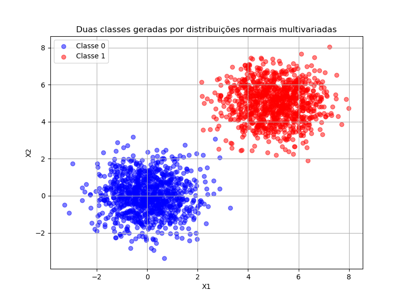
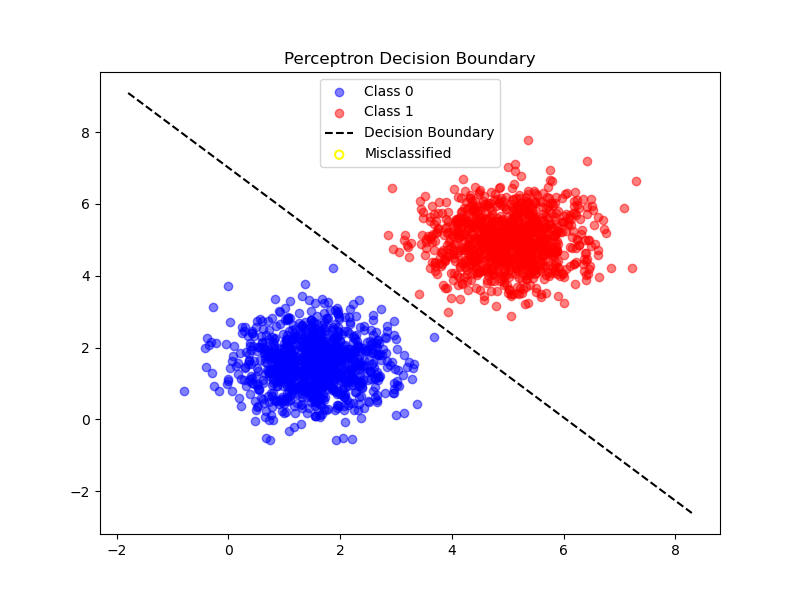
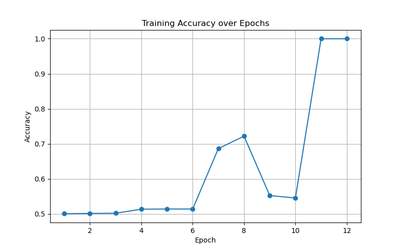

# Exercise 1

## Data Generation Task

In this exercise, we generated two classes of two-dimensional data points using multivariate normal distributions. Each class contains **1000 samples**, with the following parameters:

- **Class 0**: mean = [1.5, 1.5], covariance matrix = [[0.5, 0], [0, 0.5]]  
- **Class 1**: mean = [5, 5], covariance matrix = [[0.5, 0], [0, 0.5]]

These parameters ensure that both classes have **low internal variability** (standard deviation √0.5 along each axis, no covariance between dimensions), resulting in relatively compact clusters.  
The significant distance between the two mean vectors creates a **clear separation between the classes**, with only minimal overlap.

The plot below illustrates this separation: points from Class 0 are concentrated around (1.5, 1.5), while points from Class 1 are centered at (5, 5). Colors are used to highlight the difference, making it evident that the classes are **mostly linearly separable**.

## Perceptron Implementation

To classify the generated data, we implemented a **single-layer perceptron from scratch**, using only NumPy for basic linear algebra operations.  
The perceptron was initialized with a 2D weight vector and a bias term. Training followed the **perceptron learning rule**:  

- For each misclassified sample, update the weights and bias proportionally to the learning rate.  
- Training stops when no misclassifications occur in a full pass through the dataset (convergence) or after 100 epochs.  
- Accuracy was tracked after each epoch to monitor convergence.  

---

## Results

- The perceptron converged **very quickly** due to the linear separability of the data.  
- Final accuracy was close to **100%**, with very few or no misclassified points.  
- The decision boundary cleanly separated most data points, confirming that the perceptron is an effective linear classifier in this case.  

Converged at epoch 12
Final weights: [0.19856224 0.17118283]
Final bias: -1.2
Final accuracy: 1.0

---

## Visualization

The figure below shows the **decision boundary** overlaid on the data points.  
- Blue points correspond to **Class 0**  
- Red points correspond to **Class 1**  
- Yellow-circled points (if any) indicate **misclassifications**  

Additionally, the **training accuracy** across epochs is plotted, illustrating the rapid convergence of the perceptron:  

---

## Discussion

Because the two classes were generated with **well-separated means** and **low variance**, they are almost perfectly linearly separable.  
This allowed the perceptron to find a separating hyperplane within just a few epochs.  

If the distributions had greater overlap, convergence would have taken longer, or the perceptron could have failed to reach 100% accuracy due to inherent non-linearity in the data.  

