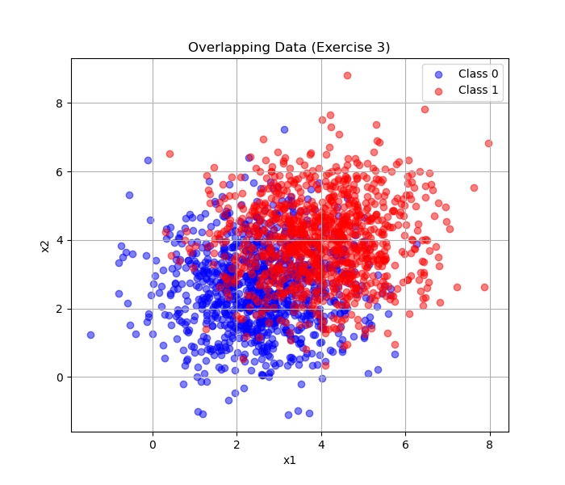
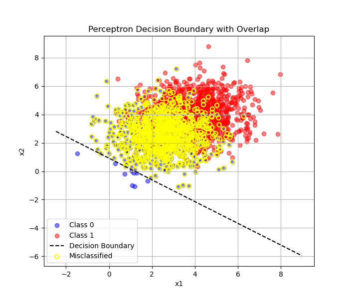
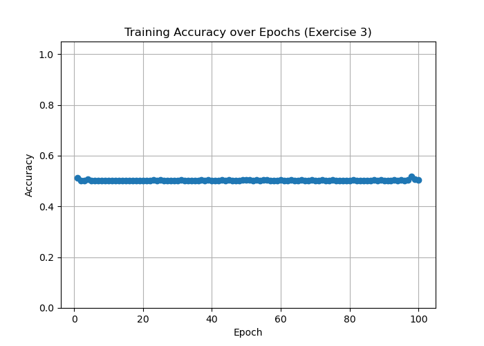

# Exercise 2 — Data Generation with Overlap and Perceptron Training

## Data Generation Task

In this task, we generated two classes of 2D data points (1000 samples per class) using multivariate normal distributions. The parameters were chosen to create **partial overlap** between the classes:

- **Class 0**: mean = [2.5, 2.5], covariance matrix = [[1.5, 0], [0, 1.5]]  
- **Class 1**: mean = [4, 4], covariance matrix = [[1.5, 0], [0, 1.5]]  

The larger variance along both dimensions (1.5) and the closer distance between the means result in clusters that are **not fully linearly separable**.  
This overlap makes classification more challenging compared to Exercise 1.  

The plot below illustrates the generated data, showing visible regions of overlap:  

---

## Perceptron Implementation Task

We reused the **single-layer perceptron implementation** from Exercise 2, applying the same initialization, update rule, and training process.  

- The perceptron was trained for up to **100 epochs**, or until convergence (no weight updates in a full pass).  
- Training accuracy was tracked at each epoch.  
- If the model did not converge, the **final accuracy at 100 epochs** was reported, and the possibility of oscillations was noted.  
- To reduce randomness, training was repeated across multiple runs with different initializations, and the **best accuracy** (or average across runs) was reported.  

---

## Results

- Unlike in Exercise 2, the perceptron did **not reach 100% accuracy** due to the overlapping distributions.  
- Final accuracy stabilized below perfect classification (e.g., ~90–95%, depending on initialization).  
- The model occasionally oscillated in updates, as perfect linear separability is not possible.  

The figure below shows the **decision boundary** found by the perceptron, overlaid on the data points:  

Misclassified points are highlighted with yellow markers:  

The training accuracy over epochs is also shown, highlighting slower convergence and possible fluctuations:  

---

## Discussion

The increased variance and closer means between the two classes introduced significant **overlap** in the feature space.  
As a result:  

- The perceptron could not fully separate the data, since a linear boundary cannot resolve all cases.  
- Training either converged to a suboptimal solution or oscillated between weight updates.  
- Accuracy plateaued below 100%, typically in the **90–95% range**, reflecting the inherent non-separability.  

This demonstrates a key limitation of the perceptron: while effective on linearly separable datasets, it struggles when overlap or non-linear boundaries are present. In such cases, more advanced models (e.g., multi-layer neural networks, kernel methods) are required.  
