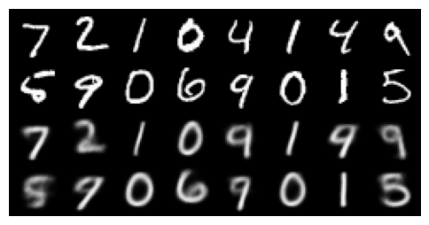

# Variational Autoencoder (VAE)
 
## Objective
The goal of this exercise was to implement and train a **Variational Autoencoder (VAE)** using the **MNIST dataset**, exploring the model’s ability to:
- Reconstruct input images;
- Generate new samples from the latent space;
- Visualize and interpret the learned latent representation.

---

## Implementation
The model was developed in **PyTorch**, consisting of:
- **Encoder** — two fully connected layers with ReLU activations producing vectors `μ` (mean) and `logσ²` (log-variance);
- **Reparameterization** — sampling via `z = μ + σ * ε`, where `ε ~ N(0, I)`;
- **Decoder** — symmetric layers ending with a Sigmoid activation;
- **Loss function** — sum of *Binary Cross-Entropy* (reconstruction) and *KL Divergence* (latent regularization).

Training configuration:
- Optimizer: **Adam** (lr = 1e-3)  
- Batch size: **128**  
- Epochs: **20**  
- Latent dimension: **2** (for visualization)  
- Dataset: **MNIST**, normalized to `[0, 1]`.

---

## Results

### 1. Loss Curves
The loss curve shows stable convergence across epochs.  
The reconstruction term dominates early training, while the KL term gradually increases.

---

### 2. Reconstructions
The model successfully reconstructs digits, preserving the general shape and structure.  
Some blurring and noise are expected due to the probabilistic nature of the VAE.

As training progresses, reconstructions become clearer and more accurate.

---

### 3. Generated Samples
By sampling latent vectors `z ~ N(0, I)` and decoding them, the VAE generates coherent and diverse digits, showing that the latent space is well structured.

Generated digits are plausible, though slightly distorted — typical for basic VAEs.

---

### 4. Latent Space Visualization
With `latent_dim = 2`, the learned latent means `μ` can be directly plotted.

Classes are smoothly organized in the 2D latent space; nearby regions correspond to similar digits (e.g., 3 and 8).  
This demonstrates that the VAE learned a meaningful and continuous representation.

## Summary

This exercise demonstrated how a VAE combines reconstruction and probabilistic modeling to learn continuous latent representations.  
Results show that the model can both reconstruct and generate coherent samples, providing a foundation for more advanced generative architectures such as convolutional VAEs and diffusion models.

## Code

If you wants to check the code used, go to Code.

